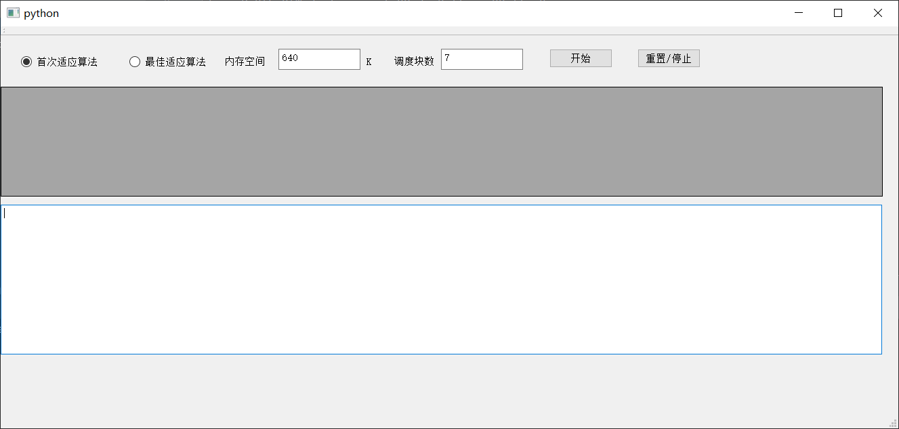
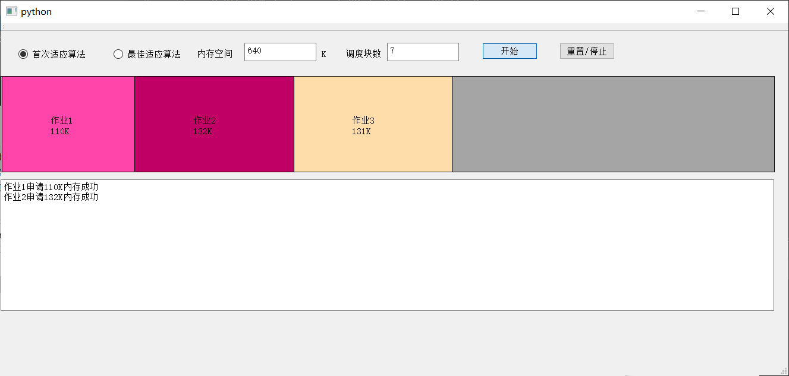
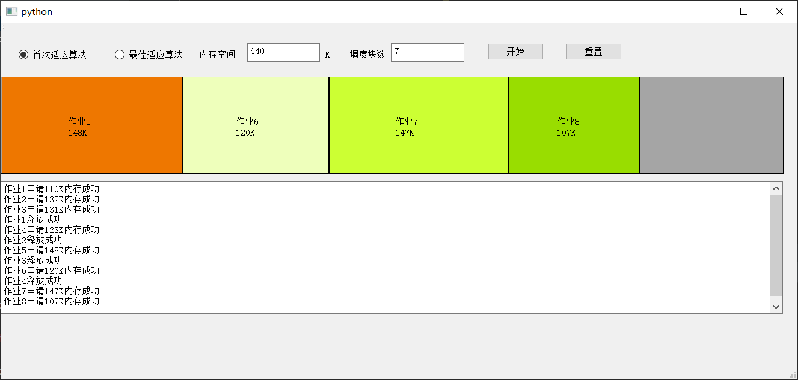
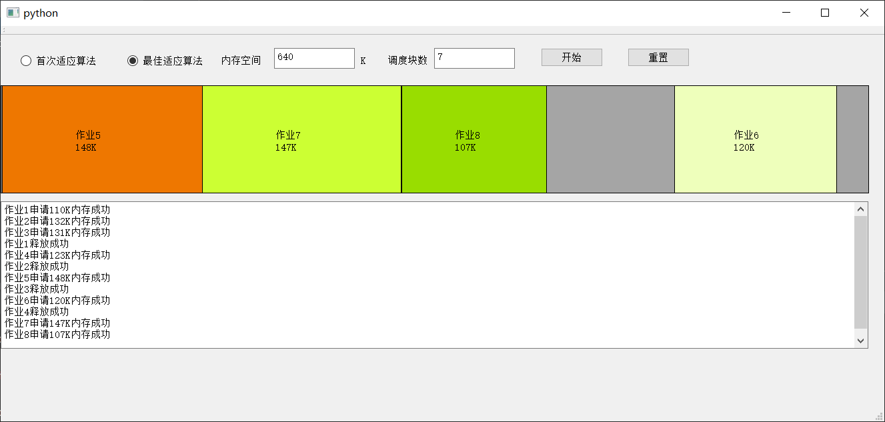

# OS第二次实验-内存分配

摆了，用Qt画动画.jpg

## 项目背景

动态分区分配是一种计算机内存管理技术，用于管理操作系统中的内存资源。在动态分区分配中，可用的内存空间被分割为多个不同大小的分区，以满足进程对内存的需求。

动态分区有如下几种算法：

- **首次适应算法**：空闲分区以地址递增的次序链接。分配内存时按顺序查找，找到大小能够满足要求的第一个空闲分区
- **最佳适应算法**：空闲分区按容量递增的次序链接，找到第一个能满足要求的空闲分区
- **最坏适应算法**：空闲分区以容量递减的次序链接，找到第一个能满足要求的空闲分区
- **临近适应算法**：由首次适应算法演变而成，不同是，分配内存从上次查找结束的位置开始继续查找

本项目模拟了两种动态分区分配的算法，并采用Qt的图形化界面显示出来

## 算法介绍

本项目实现了首次适应算法和最佳适应算法进行内存块的分配与回收

首次适应（First Fit）算法是一种常用的动态分区分配算法，用于管理计算机系统中的内存资源。该算法根据进程对内存的大小需求，选择第一个满足要求的空闲分区进行分配。

基本原理如下：

1. 初始状态：系统内存被认为是一个大的连续空闲区域。
2. 进程请求分配内存：当一个进程需要内存时，它向操作系统发出请求，请求分配一块适当大小的内存空间。
3. 分区搜索和分配：操作系统从内存的起始位置开始，搜索第一个满足进程需求大小的空闲分区。
   - 如果找到的空闲分区的大小恰好与进程需求大小相等，那么分配给进程，并将该分区标记为已分配。
   - 如果找到的空闲分区的大小大于进程需求大小，那么可以将该分区划分为两部分，一部分分配给进程，另一部分保留为未分配的空闲分区。
4. 分区合并：当进程释放内存时，操作系统可能会尝试将相邻的空闲分区合并成一个更大的连续空闲区域，以提高内存的利用率。

首次适应算法具有以下特点：

- 简单而快速：首次适应算法从内存的起始位置开始搜索，找到满足需求的第一个空闲分区，因此具有较低的搜索时间复杂度。
- 内存利用率：由于首次适应算法选择第一个满足需求的空闲分区进行分配，可能会导致较小的空闲分区产生内部碎片，从而降低了内存的利用率。

在程序中，算法代码如下：

```python
    def First_allocate(self, Job):
        for i, (start, end, p_id) in enumerate(self.memory):
            if end - start >= Job.Length and p_id is None:  # 找到第一个足够大的空闲分区
                self.memory.insert(i + 1, (start + Job.Length, end, None))  # 切割剩余的空闲分区
                self.memory[i]=(start,start+Job.Length,Job.JobName)
                Job.StatusLog()
                return True

        return False  # 找不到合适的空闲分区，返回False表示分配失败
```

最佳适应（Best Fit）算法是一种常用的动态分区分配算法，用于管理计算机系统中的内存资源。该算法根据进程对内存的大小需求，选择最小但仍然能够容纳该进程的空闲分区进行分配。

基本原理如下：

1. 初始状态：系统内存被认为是一个大的连续空闲区域。
2. 进程请求分配内存：当一个进程需要内存时，它向操作系统发出请求，请求分配一块适当大小的内存空间。
3. 分区搜索和分配：操作系统从所有空闲分区中搜索最小但仍然能够容纳进程的空闲分区。
   - 如果找到的空闲分区的大小恰好与进程需求大小相等，那么分配给进程，并将该分区标记为已分配。
   - 如果找到的空闲分区的大小大于进程需求大小，那么可以将该分区划分为两部分，一部分分配给进程，另一部分保留为未分配的空闲分区。
4. 分区合并：当进程释放内存时，操作系统可能会尝试将相邻的空闲分区合并成一个更大的连续空闲区域，以提高内存的利用率。

最佳适应算法具有以下特点：

- 内存利用率：最佳适应算法选择最小但仍然能够容纳进程的空闲分区，可以最大限度地减少内部碎片，提高内存的利用率。
- 内存碎片：相比于首次适应算法，最佳适应算法更能有效地避免产生较大的外部碎片。

然而，最佳适应算法也有一些缺点：

- 搜索开销：由于需要搜索所有空闲分区以找到最佳适应的分区，因此最佳适应算法的搜索时间复杂度较高。
- 分配速度：由于需要搜索所有空闲分区，因此最佳适应算法的分配速度相对较慢。

在程序中，最佳适应算法实现如下：

```python
    def Best_allocate(self, Job):
        best_fit_index = -1
        best_fit_size = float('inf')

        for i, (start, end, p_id) in enumerate(self.memory):
            if (end - start >= Job.Length) and (end - start < best_fit_size) and p_id is None:
                best_fit_index = i
                best_fit_size = end - start

        if best_fit_index != -1:  # 找到合适的空闲分区
            start, end, _ = self.memory[best_fit_index]
            self.memory[best_fit_index]= (start, start + Job.Length, Job.JobName)
            self.memory.insert(best_fit_index + 1, (start + Job.Length, end, None))  # 切割剩余的空闲分区
            return True

        return False  # 找不到合适的空闲分区，返回False表示分配失败
```

## 运行要求

运行依赖如下：

* python 3.10
* PyQt5

项目结构如下（当前文件夹下）：

>   main.py
>   MyUI.ui
>   ui_MyUI.py

运行方式为：

```bash
python main.py
```

模拟的内存申请释放队列为：

```python
[Job(110, "作业1"), Job(132, "作业2"), Job(131, "作业3"), Job(-110, "作业1"), Job(123, "作业4"),
                         Job(-132, "作业2"), Job(148, "作业5"), Job(-131, "作业3"), Job(120, "作业6"),
                         Job(-123, "作业4"), Job(147, "作业7"), Job(107, "作业8")]
```

其中，第一个值的正负代表申请/释放内存；第二个值模拟申请的进程ID

运行过程中，可以选择首次适应算法和最佳适应算法。点击开始按钮即可开始模拟。模拟结束后点击重置按钮可以重新选择算法并重新开始模拟

可以通过修改Management下的JobQueue来改变申请、释放的队列。确保队列有效且申请内存不为0即可

## 程序界面

代码初始界面如下:



代码运行过程如下：



首次适应算法结果如下：



最佳适应算法结果如下：



## 代码实现

动画代码如下

```python
def paintEvent(self,event):

    self.DrawUI()
    # 绘制区域的坐标
    origin_x =0
    origin_y = 90
    width = 1301
    height =161

    painter = QPainter(self)
    pen = QPen()  # 画笔
    pen.setColor(QColor(0, 0, 0))  # 黑色画笔画外框
    brush = QBrush(QColor(165, 165, 165, 255))  # 画刷
    painter.setPen(pen)  # 添加画笔
    painter.setBrush(brush)  # 添加画刷

    painter.drawRect(origin_x, origin_y, width, height)  # 绘制总体外框

    color_collection = [
        QColor("#FFB7DD"), QColor("#FF44AA"), QColor("#C10066"), QColor("#FFDDAA"),
        QColor("#FFAA33"), QColor("#EE7700"), QColor("#EEFFBB"), QColor("#CCFF33"),
        QColor("#99DD00"), QColor("#BBFFEE"), QColor("#33FFAA"), QColor("#00DD77"),
        QColor("#CCDDFF"), QColor("#5599FF"), QColor("#0044BB"), QColor("#9955FF")
    ]

    for i,(start, end, JobID) in enumerate(self.Managerment.memory):
        if JobID ==None:
            continue
        job_num = int(JobID.split('作业')[1])
        brush_temp = QBrush(color_collection[job_num % 15])
        painter.setBrush(brush_temp)  # 设置颜色


        # 位置设置
        block_x = int((width * (
                int(start) + 1) / self.Managerment.total_size) + origin_x)
        block_y = int(origin_y)
        block_width = int(width * int(end - start) / self.Managerment.total_size)
        block_height = int(height)
        print(f"int start+1={int(start)+1},width={width},end-start={end-start},total_size={self.Managerment.total_size}")
        painter.drawRect(block_x, block_y, block_width, block_height)
        print(f"{block_x},{block_y},{block_width},{block_height}")
        painter.drawText(int(block_x + block_width / 2 - width * block_width / 10000), int(block_y + block_height / 2),
                         JobID)

        job_length = str(end - start) + "K"
        painter.drawText(int(block_x + block_width / 2 - width * block_width / 10000),
                         int(block_y + block_height / 2 + height / 9), job_length)
```

首次适应算法：

```python
def First_allocate(self, Job):
    for i, (start, end, p_id) in enumerate(self.memory):
        if end - start >= Job.Length and p_id is None:  # 找到第一个足够大的空闲分区
            self.memory.insert(i + 1, (start + Job.Length, end, None))  # 切割剩余的空闲分区
            self.memory[i]=(start,start+Job.Length,Job.JobName)
            Job.StatusLog()
            return True

    return False  # 找不到合适的空闲分区，返回False表示分配失败

```

最佳适应算法：

```python
def Best_allocate(self, Job):
    best_fit_index = -1
    best_fit_size = float('inf')

    for i, (start, end, p_id) in enumerate(self.memory):
        if (end - start >= Job.Length) and (end - start < best_fit_size) and p_id is None:
            best_fit_index = i
            best_fit_size = end - start

    if best_fit_index != -1:  # 找到合适的空闲分区
        start, end, _ = self.memory[best_fit_index]
        self.memory[best_fit_index]= (start, start + Job.Length, Job.JobName)
        self.memory.insert(best_fit_index + 1, (start + Job.Length, end, None))  # 切割剩余的空闲分区
        Job.StatusLog()
        return True

    return False  # 找不到合适的空闲分区，返回False表示分配失败
```

释放内存：

```python
def Best_deallocate(self, Job):
    for i, (start, end, p_id) in enumerate(self.memory):
        if p_id == Job.JobName:  # 找到已分配给该进程的分区
            self.memory[i] = (start, end, None)  # 将该分区标记为空闲
            self.merge_free_blocks()  # 尝试合并相邻的空闲分区
            Job.StatusLog(-1)
            break
```

合并空闲内存：

```python
def merge_free_blocks(self):
    i = 0
    while i < len(self.memory) - 1:
        start1,_, p1_id = self.memory[i]
        _,end2, p2_id = self.memory[i + 1]
        if p1_id is None and p2_id is None:  # 如果相邻两个分区都是空闲分区
            self.memory[i] = (start1, end2, None)  # 合并两个分区
            self.memory.pop(i + 1)
        else:
            i += 1
```

